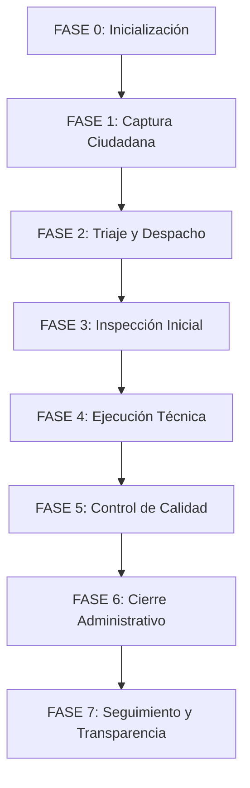
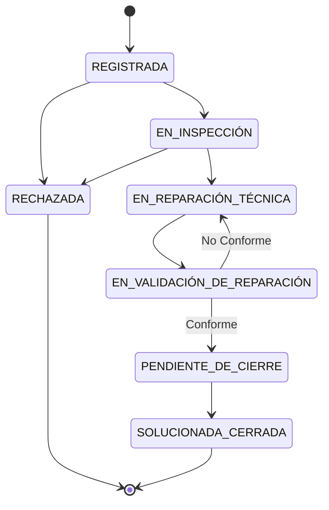

# Sistema de Gestión de Quejas Municipales - MuniQuejas
## Flujo del Programa y Ciclo de Vida

Este documento describe formalmente la línea de tiempo integral y el flujo cronológico de la aplicación MuniQuejas, diseñado como mapa maestro de arquitectura, interfaces y datos.

### 1. Sistema Bajo Demanda y Geografía
El municipio (287 km²) opera sin división por zonas. Todo el personal de campo tiene cobertura total en el municipio. El sistema opera **bajo demanda**, evaluando y agrupando quejas que apuntan al mismo problema para priorizar la atención de aquellas incidencias con mayor número de reportes ciudadanos (ej. múltiples reportes de un poste dañado tendrán mayor prioridad que un reporte aislado).

### 2. Categorías de Atención
1. Alumbrado Público
2. Drenajes y Alcantarillado
3. Vialidad y Espacios Públicos
4. Limpieza y Áreas Verdes

### 3. Roles del Sistema
- **Administrador del Sistema**: Gestiona usuarios, personal y configuración del ecosistema municipal.
- **Ciudadano (Vecino)**: Usuario final que reporta quejas, consulta seguimiento y notifica reincidencias/agravamientos.
- **Funcionario Municipal**: Recepciona, tria, prioriza, asigna y realiza el cierre administrativo de los expedientes.
- **Inspector de Campo**: Acude físicamente para validar daños, y posteriormente valida las reparaciones (auditoría de calidad).
- **Especialista Técnico (Cuadrilla)**: Ejecuta la reparación en sitio, consume insumos y documenta la solución técnica.

### 4. Diagrama del Proceso General

### 5. Diagrama de Estados de la Queja

*(Nota: En estado activo, el ciudadano puede reportar "Agravamiento". Tras el cierre, puede reportar "Reincidencia" o "Inconformidad", generando quejas hijas vinculadas al historial original).*

---

### Línea de Tiempo Detallada por Fases

#### Fase 0: Configuración Previa y Base Operativa
* **Actor principal**: Administrador del Sistema
* **Propósito**: Dejar listo el ecosistema municipal antes de recibir quejas ciudadanas.
1. **Configuración de Catálogos**: Habilitación de las 4 categorías principales.
2. **Alta de Personal Municipal**: Creación de cuentas internas (el personal municipal no se autoregistra):
   * Asignación de Inspectores de Campo.
   * Asignación de Especialistas Técnicos a cuadrillas (con áreas de especialidad/componentes).
   * Asignación de permisos a Funcionarios para recepción, despacho y cierre.

#### Fase 1: Entrada Ciudadana y Apertura del Expediente
* **Actor principal**: Ciudadano (Vecino)
* **Momento**: Cualquier día y hora a través del portal web ciudadano.
1. **Registro y Acceso**: El vecino se registra con DPI (13 dígitos inmutables), teléfono y contraseña cifrada (BCrypt). Recibe un token JWT al iniciar sesión.
2. **Formulación del Reporte**:
   * Selecciona categoría y subcategoría.
   * Ingresa dirección con punto de referencia.
   * Sitúa un marcador en el mapa interactivo para registrar latitud y longitud.
   * Escribe la descripción de los hechos (entre 20 y 500 caracteres).
   * Adjunta de 1 a 3 fotografías de evidencia (máximo 5 MB cada una).
3. **Procesamiento del Sistema**:
   * Genera correlativo único: `QUE-2026-XXXXXX`.
   * Calcula prioridad sugiriendo la agrupación de reportes cercanos sobre la misma problemática (sistema bajo demanda).
   * Almacena evidencias y registra el estado inicial `REGISTRADA`.
4. **Respuesta en Pantalla**: El ciudadano visualiza la confirmación, el código de seguimiento, y el caso aparece en "Mis Quejas".

#### Fase 2: Triaje, Priorización y Despacho Territorial
* **Actor principal**: Funcionario Municipal
* **Momento**: Horas laborales en el centro de monitoreo municipal.
1. **Monitoreo de Bandeja**: El funcionario visualiza en tiempo real solicitudes en estado `REGISTRADA`.
2. **Evaluación de Admisibilidad**:
   * Revisa si compete a la municipalidad. Si no procede (propiedad privada, incompetencia), redacta justificación y transiciona a `RECHAZADA`, notificando al vecino.
3. **Priorización por Demanda Comunitaria**:
   * Revisa la prioridad sugerida (alertas de focos con múltiples reportes). Confirma o ajusta la prioridad formal para agrupar esfuerzos.
4. **Asignación Territorial**:
   * Selecciona al inspector disponible y redacta directrices de la visita.
5. **Resultado**: La queja pasa a `EN INSPECCIÓN`.

#### Fase 3: Inspección Técnica In Situ y Apertura de Carpeta Técnica
* **Actor principal**: Inspector de Campo
* **Momento**: Desplazamiento presencial en campo.
1. **Gestión de Ruta**: Revisa dirección, fotos y ruta.
2. **Constatación Presencial**: Acude para corroborar el daño (evitando falsas alarmas).
3. **Informe de Inspección Inicial (Fase 1 del Expediente)**:
   * Valida la veracidad del reporte (puede rechazar con justificación si es falsa alarma).
   * Clasifica la gravedad real (`LEVE`, `MODERADA`, `GRAVE`, `CRITICA`).
   * Redacta el diagnóstico y recomienda recursos (maquinaria, insumos).
   * Captura y carga fotos en el lugar.
   * Deriva a la cuadrilla de Especialistas Técnicos responsable según el daño.
4. **Resultado**: La queja cambia a `EN REPARACIÓN TÉCNICA`.

#### Fase 4: Ejecución Operativa de la Obra en Terreno
* **Actor principal**: Especialista Técnico / Jefe de Cuadrilla
* **Momento**: Programación y ejecución de obra física.
1. **Cola de Trabajo**: Consulta bandeja técnica priorizada.
2. **Revisión del Expediente**: Consulta el diagnóstico del inspector antes de salir.
3. **Reparación en Sitio**: Realiza trabajo físico según especialidad.
4. **Informe de Solución Técnica**:
   * Detalla el trabajo finalizado.
   * Registra materiales consumidos y horas invertidas.
   * Carga obligatoriamente fotos nítidas de la obra concluida.
5. **Resultado**: La queja cambia a `EN VALIDACIÓN DE REPARACIÓN`. Se transfiere a la bandeja del inspector original.

#### Fase 5: Auditoría de Calidad y Visto Bueno de Campo
* **Actor principal**: Inspector de Campo
* **Momento**: Re-inspección presencial tras finalización de obra.
1. **Bandeja de Validación**: Accede a la queja para validar.
2. **Comparativa en Pantalla**: Observa el "antes y después".
3. **Segunda Visita en Terreno**: Audita durabilidad y cumplimiento de estándares.
4. **Dictamen de Conformidad (Fase 2 del Expediente)**:
   * *No Conforme*: Detalla fallas, documenta y devuelve a cuadrilla (`EN REPARACIÓN TÉCNICA` con máxima prioridad para re-trabajo).
   * *Conforme*: Redacta observaciones del visto bueno y adjunta fotos de auditoría.
5. **Resultado**: La queja avanza a `PENDIENTE DE CIERRE`. Regresa al Funcionario Municipal.

#### Fase 6: Auditoría Integral y Cierre Administrativo
* **Actor principal**: Funcionario Municipal
* **Momento**: Validación administrativa final.
1. **Revisión Consolidada**: Verifica que el expediente cumpla con evidencias (Diagnóstico inicial, reporte de recursos, visto bueno, galería completa).
2. **Formalización del Cierre**: Ingresa conclusiones y aprueba la resolución.
3. **Resultado**: El estado cambia a `SOLUCIONADA / CERRADA`. Quejas hijas agrupadas se cierran en cascada. Se notifica al ciudadano.

#### Fase 7: Seguimiento, Transparencia y Quejas Hijas
* **Actor principal**: Ciudadano
* **Momento**: Durante todo el ciclo y posterior al cierre.
1. **Trazabilidad Completa**: El ciudadano ve su barra de progreso y fotos públicas del proceso.
2. **Agravamiento (Queja Activa)**: Durante el proceso, el usuario puede reportar un empeoramiento del daño, alertando al sistema sin crear un expediente aislado.
3. **Reincidencia e Inconformidad (Queja Cerrada)**: Tras el cierre, puede reportar si la reparación falló (reincidencia) o generar una inconformidad. El sistema crea una "queja hija" enlazada al historial original.
4. **Descarga de Constancia**: Emisión de constancia oficial en PDF con resolución del municipio.

#### Fase Transversal: Inteligencia de Negocio y Reportería
* **Actores**: Funcionario y Administrador
* **Funciones**:
  - Reportes por Fechas y Estados.
  - Reportes por Categorías (identificación de sectores problemáticos).
  - Rendimiento de Cuadrillas (tiempos promedio, re-trabajos, consumo de insumos).
  - Exportación de métricas.
